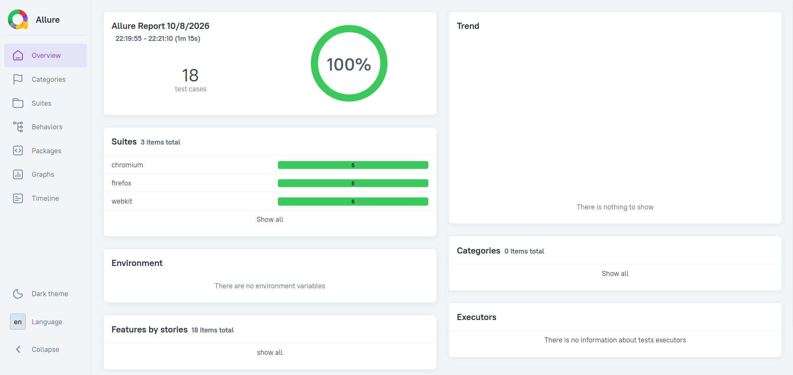

# Demo Web Shop Test Automation

End-to-end test automation for the [Demo Web Shop](https://demowebshop.tricentis.com/) using Playwright, JavaScript and the Page Object Model, with Allure and Playwright HTML reporting.

## What is tested

| Test file | Scenario |
| :--- | :--- |
| `invalid-login.test.js` | Login attempts with a wrong email, a wrong password, and both wrong |
| `register.test.js` | New account registration |
| `login.test.js` | Login with a registered account |
| `add-to-cart.test.js` | Register, log out, log in, add a desktop computer to the cart, verify product name and quantity in the cart |
| `search-product.test.js` | Search for a product, open it, set quantity to 2, add to cart, verify quantity in the cart |
| `checkout.test.js` | Search, add to cart, complete all checkout steps, verify the order confirmation message |

The 6 tests run on 3 browser projects (Chromium, Firefox, WebKit), giving 18 test runs per execution.

## Tech stack

- Playwright Test
- JavaScript (ES modules)
- Page Object Model
- Allure Report and Playwright HTML report
- Node.js 20+

## Project structure

```
.
├── pages/                  Page objects (BasePage and one class per page or flow)
├── tests/                  Test files
├── docs/                   Report screenshot
├── playwright.config.js    Browsers and reporters
└── package.json
```

## Requirements

- Node.js 20 or later
- Java (only for generating the Allure report)

## Setup

```bash
git clone https://github.com/AzmaeenGH/demo-web-shop-test-automation.git
cd demo-web-shop-test-automation
npm install
npx playwright install
```

## Run

```bash
npm test
```

Run one file or one browser:

```bash
npx playwright test tests/checkout.test.js
npx playwright test --project=chromium
```

## Reports

Playwright HTML report:

```bash
npm run report
```

Allure report (run after `npm test`):

```bash
npm run allure:generate
npm run allure:open
```



## Notes and limitations

- Tests run against a public demo site that is shared and can change or be slow.
- Each test creates its own account with a unique email, so test files run alone or together.
- The invalid login, register and login tests exercise those flows. Their outcome checks are limited and can be strengthened with explicit assertions.
- Checkout uses dummy billing data.

## Author

Azmaeen Galib Hassan  
[LinkedIn](https://www.linkedin.com/in/azmaeen-gh) | [Portfolio](https://azmaeengh.github.io)
